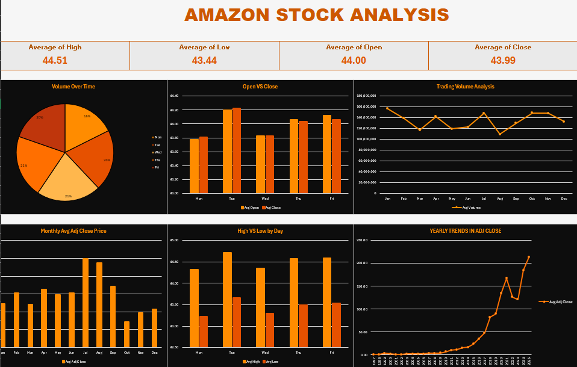

# Amazon (AMZN) Stock Analysis Dashboard — Excel

An interactive Excel dashboard analyzing **28.3 years of Amazon daily stock data** (15 May 1997 – 12 Sep 2025, **7,127 trading days**). Built entirely with native Excel formulas and charts — every number on the dashboard is traceable back to the raw daily rows.



---
## Presentation Deck: https://amazon-amzn-stock-analys-4qspxzf.gamma.site/
---

## Key Findings

| Metric | Value |
|---|---|
| Trading days analyzed | 7,127 |
| Date range | 1997-05-15 → 2025-09-12 |
| First adj close | $0.0979 |
| Last adj close | $228.15 |
| Total growth | **2,330×** |
| CAGR | **31.5%** |
| All-time high close | $242.06 (2025-02-04) |
| Average daily volume | 134.3M shares |
| Total volume traded | 957.0B shares |
| Average daily range (H−L) | 1.07 |
| Up days (close > open) | 50.1% |

**Headline averages across full history:** High **44.51** · Low **43.44** · Open **44.00** · Close **43.99**

### Insights

1. **Compounding, not daily drift.** Open and close average within one cent of each other and only 50.1% of days close green — all the return came from long-run trend.
2. **One real drawdown.** Yearly average adj close peaked at **167.19 (2021)**, fell to **126.10 (2022)** and **121.37 (2023)**, then recovered to **184.63 (2024)** and **213.03 (2025)**.
3. **Volume is seasonal.** Heaviest in **January (156.4M)**, lightest in **August (109.6M)** — a 30% swing.
4. **Mid-week carries the flow.** Wednesday (21%) and Thursday (21%) lead volume; Monday is thinnest (18%).
5. **No day-of-week price edge.** Differences between weekday averages are under 1% on a ~$44 base — a useful negative result.

---

## Dashboard Components

**KPI cards:** Average High, Low, Open, Close

**Charts**
| Chart | Type | Shows |
|---|---|---|
| Volume Over Time | Pie | Total volume share by weekday |
| Open VS Close | Clustered column | Avg open vs close by weekday |
| Trading Volume Analysis | Line | Avg volume by calendar month |
| Monthly Avg Adj Close Price | Column | Avg adjusted close by month |
| High VS Low by Day | Clustered column | Avg high vs low by weekday |
| Yearly Trends in Adj Close | Line | Avg adjusted close, 1997–2025 |

Theme: orange on black.

---

## Project Structure

```
├── AMZN_1997-05-15_2025-09-14.xlsx
│   ├── AMZN_1997-05-15_2025-09-14   # Raw OHLCV data + helper columns
│   ├── Calc                          # Aggregation tables + key facts
│   └── Dashboard                     # KPI cards + 6 charts
├── data/
│   └── AMZN_1997-05-15_2025-09-14.csv
└── assets/
    └── dashboard.png
```

### Data Model

**1. Raw data** (`A:G`) — `date`, `open`, `high`, `low`, `close`, `adj_close`, `volume`

**2. Helper columns** (`H:K`), one formula filled down all 7,127 rows:
```excel
H: =YEAR($A3)
I: =MONTH($A3)
J: =TEXT($A3,"mmm")
K: =TEXT($A3,"ddd")
```

**3. Aggregation tables** (`Calc`) — driven by `AVERAGEIF` / `SUMIF`:
```excel
Weekday avg open  =AVERAGEIF(Data!$K$3:$K$7129,$A2,Data!$B$3:$B$7129)
Weekday volume    =SUMIF(Data!$K$3:$K$7129,$A2,Data!$G$3:$G$7129)
Monthly adj close =AVERAGEIF(Data!$J$3:$J$7129,$H2,Data!$F$3:$F$7129)
Yearly adj close  =AVERAGEIF(Data!$H$3:$H$7129,$L2,Data!$F$3:$F$7129)
```

**4. Key facts** (`Calc!A9:B23`) — CAGR, total growth, all-time high, up-day rate:
```excel
CAGR              =(B14/B13)^(1/B16)-1
Total growth (x)  =B14/B13
Up days %         =SUMPRODUCT(--(Data!$E$3:$E$7129>Data!$B$3:$B$7129))/COUNT(Data!$E$3:$E$7129)
```

All charts read from `Calc`, so replacing the raw data refreshes the entire dashboard.

---

## Methodology & Limitations

- **Adjusted close** is used for all trend analysis so splits and distributions don't distort history.
- **Averages are of price levels, not returns.** Because AMZN grew exponentially, monthly/weekday price averages are dominated by *when* in calendar time the growth occurred — they are descriptive, not a trading signal.
- **No risk metrics.** Volatility, drawdown depth, and Sharpe-type measures are not included.
- **Single ticker, no benchmark.** No comparison against S&P 500 or sector peers.

---

## Tech Stack

Microsoft Excel — formulas (`AVERAGEIF`, `SUMIF`, `SUMPRODUCT`, `INDEX/MATCH`, `TEXT`), native charts, conditional formatting. No macros, no add-ins.
